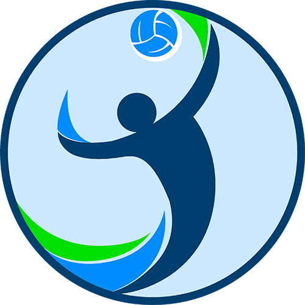

# Volleyball League Platform Library

    

## What is it?
Volleyball League is a platform that brings everything necessary to organize and to run a league.
This is the 4th generation of the software developed over the last 20 years and a complete re-write.

## Any questions?

## Features

 * Indoor and beach leagues
 * Registration of teams
 * Team contacts and players
 * User administration and authorization
 * Fixtures incl. calendar export
 * Fixture changes, entry of results
 * Match report sheets
 * Result lists and tables
 * Automatic notifications and reminders
 * Shared use of venues
 * Referees
 * Local accounts and most popular social logins implemented

## Software design

 * Individual settings (e.g. number of records, number of rounds, etc.)
 * Individual pages, e.g. for the game rules
 * Configuration changes are possible at runtime (even to add/remove a tenant)
 * Optimized for mobile devices: Comfortable operation on smartphones, tablets or desktop PCs
 * Localizable for language, region and time zone (currently with translations to English and German)
 
 ## Technology
 
  * ASP.NET 6.0 web-development framework
  * C# programming language
  * Microsoft SQL-Server 2016+ database is currently implemented. [See supported databases](https://www.llblgen.com/Pages/specifications.aspx)
  * Integrates Bootstrap 5
  * Using plain vanilla javascript (no dependency on jQuery)

## License

The platform software is Open Source under the [MIT license](LICENSE)

## Live website
  
  There is a [live website](https://volleyball-liga.de/) running the platform software.
  
## Development demo website

### Database installation

Before running the `League.Demo` project for the first time, the MSSQL databases must be installed. 

A backup of the two demo databases is located in `League.Demo/Seed/Demo-Db.zip`. Restore the databases to your local MSSQL Server (Express) instance. Then adjust the connection string for the server in `Credentials.Development.json`.

The default database names are `TestOrg` and `OtherOrg`. You may change these names, but then update the `DbContext/Catalog` name in `Tenant.TestOrg.Development.config` and  `Tenant.OtherOrg.Development.config` accordingly.

### Admin login

  The **admin login** for the two demo tenants is:
  * Username: demo
  * Email: demo@axuno.net
  * Password: demodemo
  
## Thanks!

We would like to thank [JetBrains](https://www.jetbrains.com/?from=Volleyball-League) for supporting the project with free licenses of their fantastic tools ReSharper and DotCover.

 
